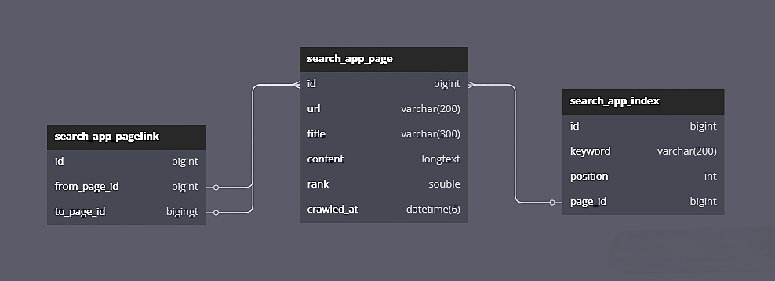
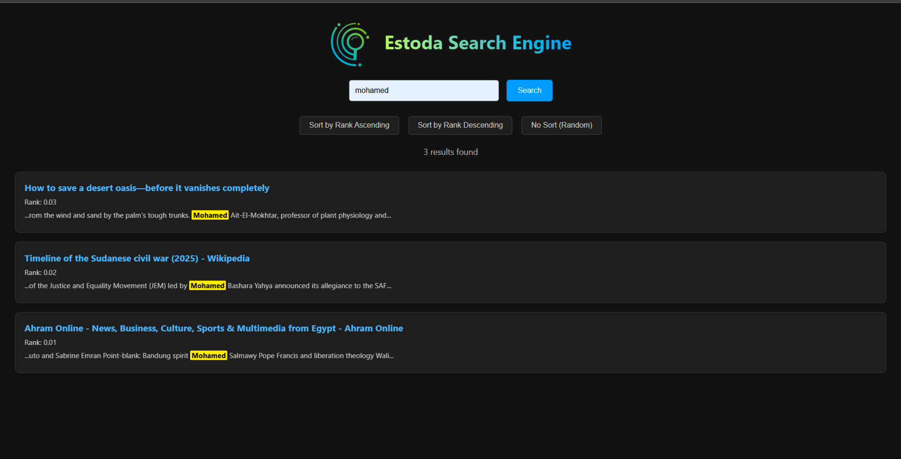

# Estoda Search Engine

A web-based search engine built with Django, Docker, and MySQL, supporting crawling, indexing, ranking, and highlighting.

# Estoda Search Engine

A web-based search engine built with Django, Docker, and MySQL, supporting crawling, indexing, ranking, user authentication, and keyword highlighting.

```text
Search-Engine/
│
├── backend/                    # Django backend project
│ ├── manage.py
│ ├── Dockerfile                # Dockerfile for backend
│ ├── static/                   # Static files (CSS, JS, images)
│ ├── backend/                  # Django project root
│ │ ├── __init__.py
│ │ ├── settings.py
│ │ ├── urls.py
│ │ ├── asgi.py
│ │ └── wsgi.py
│ └── search_app/              # Core search app
│   ├── models.py
│   ├── views.py
│   ├── serializers.py
│   ├── urls.py
│   └── templates/
│       ├── login.html
│       ├── register.html
│       └── search.html
│
├── crawler/
│ ├── crawler.py               # Async crawler (aiohttp + BeautifulSoup)
│ └── pagerank.py              # PageRank algorithm
│
├── docker/
│ └── docker-compose.yml       # Docker Compose for services
│
├── docs/                      # Diagrams, UI, ERD
│ ├── ERD.png
│ └── UI.png
└── README.md                  # Project documentation
```
---

## Features:
* Async web crawler with `aiohttp` and `playwright` fallback.
* Inverted index for full-text search.
* PageRank algorithm to rank results.
* Keyword highlighting in title and content.
* User Authentication system.
    - Registration
    - Login (with JWT access/refresh tokens)
    - Protected Search Page
    - Logout 
* Dockerized backend for easy deployment.
* REST API using Django REST Framework.

---

## Technologies Used:

- Backend: Django REST Framework
- Database: MySQL (via Docker)
- Crawler: Python + aiohttp + BeautifulSoup + Playwright
- Frontend: HTML/CSS (basic template)
- Deployment: Docker, Docker Compose

---

## Database Schema (ERD):

The following diagram shows the structure of the database and the relationship between entities:
 

---

## UI Preview:



---

## Installing and Running the Project:

```bash
git clone https://github.com/Estoda/Search-Engine
cd Search-Engine/docker
docker compose up --build
```

---
## Useful Commands: 

```bash
# Enter the web container:
docker compose exec -it docker-web-1 bash

# Run the migrations:
python manage.py migrate

# Collect static files:
python manage.py collectstatic
```

---

## Crawler Notes:

- Run `crawler/crawler.py` to crawl and store web pages and links.
- Run `crawler/pagerank.py` after crawling to compute PageRank and update database

---

## Docker Image:

This project is available as a public Docker image on Docker Hub:
[https://hub.docker.com/repository/docker/estoda/search-engine-backend/general](https://hub.docker.com/repository/docker/estoda/search-engine-backend/general)

---


## API Documentation:

This project includes auto-generated API documentation using:

- **Swagger UI**: [http://localhost:8000/swagger/](http://localhost:8000/swagger/)
- **ReDoc** [http://localhost:8000/redoc/](http://localhost:8000/redoc/)

The schema is generated using `drf-yasg`, and documents all available search endpoints and query parameters.